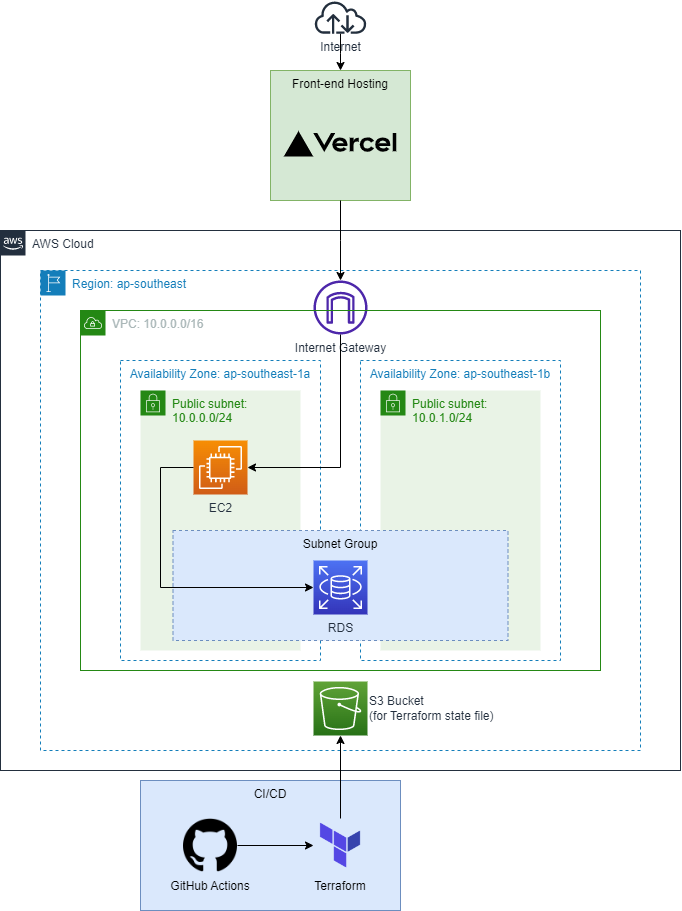

# IS212 Software Project Management - G2T4 Bertrand Meyer

## Table of Contents
* [Group Members](#group-members-sunglasses)
* [Architecture Diagram](#architecture-diagram-globe_with_meridians)
    * [Pre-requisites](#pre-requisites)
* [CI/CD - GitHub Actions](#cicd---github-actions)
    * [Environment Variables](#environment-variables)
* [Front-end Deployment](#front-end-deployment)
* [API Application Deployment](#api-application-deployment)

## Group Members :sunglasses:
* Amelia Tay
* James Tee
* Leam Ming Yao
* Tanya Khoo
* Trisha Tan
* Yong Woon Hao

## Architecture Diagram :globe_with_meridians:

**CREDENTIALS AND OTHER SENSITIVE VALUES HAVE BEEN REMOVED FOR SECURITY AND PRIVACY REASONS**

### Pre-requisites
*Perform the following actions in Singapore (ap-southeast-1) region*
1. Create an S3 bucket named `ljps`
2. Create a key pair named `ljps-ec2`, which will be used by Terraform to configure SSH access into the EC2 instance for deployment

The above steps are necessary before running the CI/CD pipeline so that Terraform will be able to configure correctly.

## CI/CD - GitHub Actions

A more in-depth description of our CI/CD Pipeline and Git process can be found in our [Confluence page](https://spm-g2t4.atlassian.net/wiki/spaces/SPMG2T4/pages/4063263/CI+CD+Pipeline+Git+Process).

### Environment Variables

*Certain variables have been stored as environment variables for increased security as they are sensitive and not to be leaked to the public*

| Name | Description |
| ----------- | ----------- |
| ACCESS_KEY | AWS credentials - For use with Terraform to provision resources |
| SECRET_KEY | AWS credentials - For use with Terraform to provision resources |
| SSH_PRIVATE_KEY | Private key for the EC2 instance, used by `Infrastructure & Deployment` workflow to SCP and SSH into instance for deployment |
| USERNAME | Username of admin user in RDS - For use with Terraform |
| PASSWORD | Password of admin user in RDS - For use with Terraform |
| PORT | Port opened in RDS - For use with Terraform |

## Front-end Deployment

**Ensure that the latest version of Node.js is installed**

*Take note that due to certain cost limitations where we are not able to obtain a domain for our backend application in the cloud, this Vercel deployment is unable to interact with the backend. This is because a HTTPS hosted frontend cannot interact with a HTTP hosted backend due to security reasons. Therefore, it is deployed on localhost for now.*

1. Navigate to the **frontend** directory in the terminal

2. Run the command `npm install` and `npm install axios` to install the required dependencies for the frontend application

3. To deploy the application on localhost, run the following command `npm run start` and visit the site at the URL: http://localhost:3000

That's it!

## API Application Deployment

There is no need to deploy the backend locally as it has been deployed on the AWS cloud in an EC2 instance already. However if there is a need to deploy it locally, follow the instructions given:

1. Navigate to the backend directory and run the `ljps.py` python file

2. The backend application can be accessed through the URL: http://localhost:5000, appending the different API routes as needed